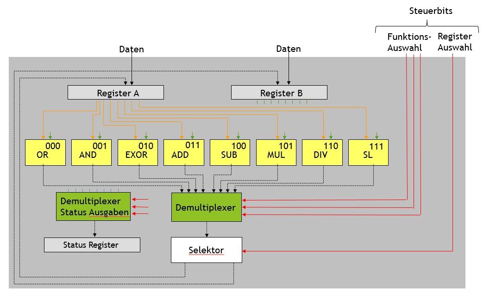
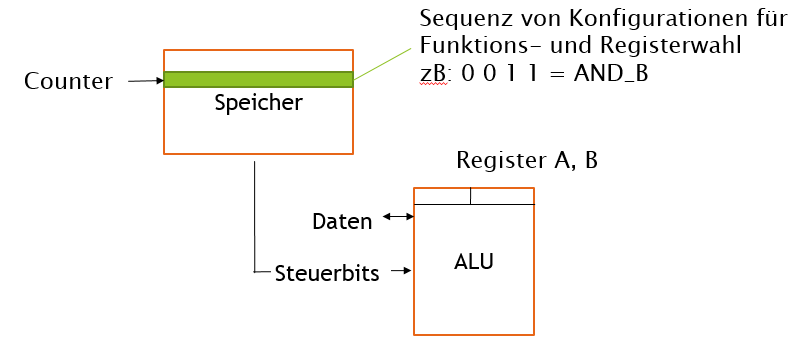

<!--

author:   Sebastian Zug
email:    zug@ovgu.de   
version:  0.0.1
language: de
narrator: Deutsch Female

import: https://raw.githubusercontent.com/liaScript/rextester_template/master/README.md

-->

# Von der Gatterlogik zu Modell-CPU

**Lehrprobe an der Otto-von-Guericke Universität Magdeburg**

Prof. Dr. Sebastian Zug

02. April 2019

---------------------------------------------------------------------

## 1 - Prüfungsfrage(n)

**Beschreiben Sie die Wertetabelle eines Volladierers und skizzieren Sie desses Gatterlogik!**

| $a$ | $b$ | $c_{in}$ | $c_{out}$ | $s$ |
| --- | --- | -------- | --------- | --- |
| 0   | 0   | 0        | 0         | 0   |
| 0   | 0   | 1        | 1         | 0   |
| 0   | 1   | 0        | 1         | 0   |
| 0   | 1   | 1        | 0         | 1   |
| 1   | 0   | 0        | 1         | 0   |
| 1   | 0   | 1        | 0         | 1   |
| 1   | 1   | 0        | 0         | 1   |
| 1   | 1   | 1        | 1         | 1   |

---------------------------------------------------------------------

Volladdierer, zusammengesetzt aus zwei Halbaddierern, sowie 4 Bit Addierwerk mit Fortschreibung des Carrys.

<!-- width="90%" --> [WikiAdd]

## 2 - Auf dem Weg zum Universalrechner … Zwischenstand 1

| Realisierte Features          | Wunschliste                                                                                                                                                                                               |
| ----------------------------- | --------------------------------------------------------------------------------------------------------------------------------------------------------------------------------------------------------- |
| 1. Addition von einzelnen Werten         | Flexibles Handling für mehrere Operationen   \* Logische Funktionen: `NOT`, `AND`, `OR`, `EXOR`   \* Arithmetische Funktionen: `ADD`, `SUB`, `(MUL)`, `(DIV)`    \* Sonstige: `SHIFT LEFT`, `SHIFT RIGHT` |

 <!-- width="90%" -->

 <!-- width="80%" -->

## Anhang

Link auf die aktuelle Vorlesung im Versionsmanagementsystem GitHub

Erläuterungen

### Fragen an die heutige Veranstaltung

**Welche Funktion haben die sogenannten Steuerleitungen beim Betrieb der CPU?**

[( )] Triggern der Abarbeitung der Befehle
[(X)] Spezifikation der Zustände bestimmter Komponenten
[( )] Definition der Adressen des Programmspeichers
[[?]] Mit den Steuerbits wurden unter anderem die spezifischen ALU Operationen adressiert.

**Der Befehlssatz einer (Modell)-CPU umfasst 27 Befehle. Wie viele Bit muss die korrespondierende OP-Code Repräsentation mindestens umfassen?**

[[5]]
[[?]] Mit welcher Potenz von zwei werden 27 Zustände abgedeckt?

**...**

### Referenzen und Literaturhinweise

[WikiAdd] Wikipedia, "Addierwerk", Von 30px MovGP0 - selbst erstellt mit Inkscape, CC BY-SA 2.0 de, https://commons.wikimedia.org/w/index.php?curid=22912742

### Autoren

Sebastian Zug
