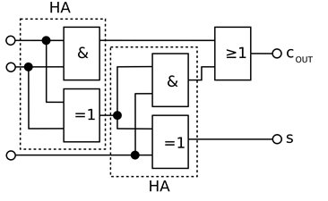

<!--

author:   Sebastian Zug
email:    zug@ovgu.de   
version:  0.0.1
language: de
narrator: Deutsch Female

import: https://raw.githubusercontent.com/liaScript/rextester_template/master/README.md

-->

# Von der Gatterlogik zu Modell-CPU

**Lehrprobe an der Otto-von-Guericke Universität Magdeburg**

Prof. Dr. Sebastian Zug

02. April 2019

---------------------------------------------------------------------
Link auf die aktuelle Vorlesung im Versionsmanagementsystem GitHub

## 1 - Prüfungsfrage

**Zielstellung der Veranstaltung**

Beschreiben Sie die Wertetabelle eines Volladierers und skizzieren Sie desses Gatterlogik!

| $a$ | $b$ | $c_{in}$ | $s$ | $c_{out}$ |
| --- | --- | -------- | --- | --------- |
|     |     |          |     |           |

<!-- width="90%" -->

*******************************************************************************

                                    {{1-2}}
*******************************************************************************
