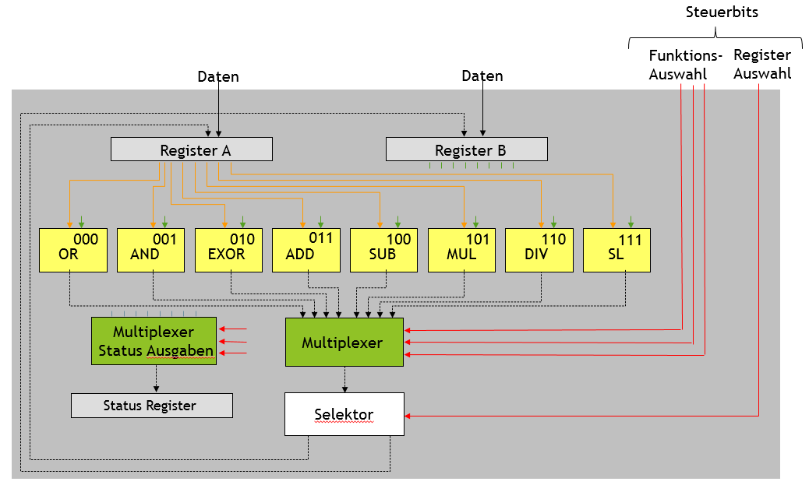
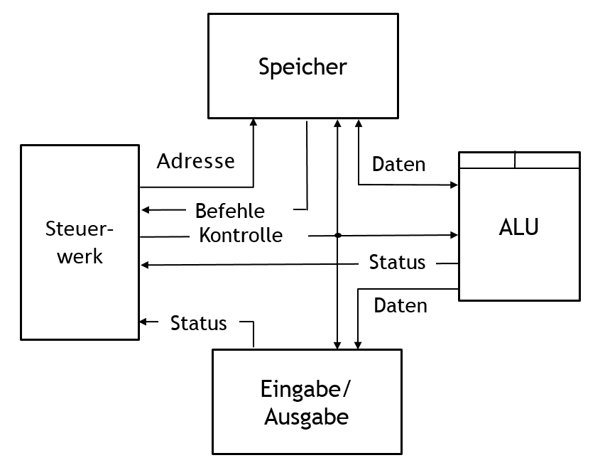

<!--

author:   Sebastian Zug
email:    zug@ovgu.de   
version:  0.0.1
language: de
narrator: Deutsch Female

link: https://cdnjs.cloudflare.com/ajax/libs/animate.css/3.7.0/animate.min.css

import: https://raw.githubusercontent.com/liaScript/rextester_template/master/README.md
import: https://raw.githubusercontent.com/liaScript/logicemu_template/master/README.md

-->

# Von der Gatterlogik zu Modell-CPU

Prof. Dr. Sebastian Zug

 02. April 2019

```armasm
section .data
  hello:     db 'Herzlich willkommen',10
  helloLen:  equ $-hello          

section .text
	global _start

_start:
	mov eax,4       
	mov ebx,1            
	mov ecx,hello       
	mov edx,helloLen    
	int 80h             
	mov eax,1            
	mov ebx,0           
	int 80h;
```
@Rextester.eval(@Nasm)

Die interacktive Version des Vortrages findet sich unter [LiaScript](https://liascript.github.io/course/?https://raw.githubusercontent.com/SebastianZug/Lia_Gatter/master/README.md#1)

---------------------------------------------------------------------

## 1 - Prüfungsfrage(n)

**Beschreiben Sie die Wertetabelle eines Volladierers und skizzieren Sie desses Gatterlogik!**

<!-- class="animated fadeIn" -->
                                    {{0-1}}
********************************************************************************

| $a$ | $b$ | $c_{in}$ | $s$ | $c_{out}$ |
| --- | --- | -------- | --- | --------- |
| 0   | 0   | 0        | 0   | 0         |
| 0   | 0   | 1        | 1   | 0         |
| 0   | 1   | 0        | 1   | 0         |
| 0   | 1   | 1        | 0   | 1         |
| 1   | 0   | 0        | 1   | 0         |
| 1   | 0   | 1        | 0   | 1         |
| 1   | 1   | 0        | 0   | 1         |
| 1   | 1   | 1        | 1   | 1         |

---------------------------------------------------------------------

********************************************************************************

<!-- class="animated fadeIn" -->
                                    {{0-2}}
********************************************************************************

Volladdierer, zusammengesetzt aus zwei Halbaddierern, sowie 4 Bit Addierwerk mit Fortschreibung des Carrys.

<!-- width="40%" --> [WikiAdd](#9)

********************************************************************************

<!-- class="animated fadeIn" -->
                                      {{1}}
********************************************************************************


``` text @LogicEmu.run
         "8"   "4"   "2"   "1"
 "S"      l     l     l     l
          ^     ^     ^     ^
    l<o<a e o<a e o<a e o<a e s
      ^ ^^^/^ ^^^/^ ^^^/^ ^^^/
      a e * a e * a e * a e *
      ^^^   ^^^   ^^^   ^^^
      * *   * *   * *   * *
 "A"  s *   s *   s *   s *    
        *     *     *     *
 "B"    s     s     s     s
```


Dokumentation und Beispiele unter [Link](https://lodev.org/logicemu/)

********************************************************************************

## 2 - Zielstellung 1 ... Variable Operationen

<!-- class="animated fadeIn" -->
                                    {{0-1}}
********************************************************************************

| Realisierte Features          | Wunschliste                                                                                                                                                                                               |
| ----------------------------- | --------------------------------------------------------------------------------------------------------------------------------------------------------------------------------------------------------- |
| 1. Addition von einzelnen Werten  <br> <br> <br> <br>| Flexibles Handling für mehrere Operationen <br> \* Logische Funktionen: `NOT`, `AND`, `OR`, `EXOR` <br> \* Arithmetische Funktionen: `ADD`, `SUB`, `(MUL)`, `(DIV)` <br>  \* Sonstige: `SHIFT LEFT`, `SHIFT RIGHT` |

********************************************************************************

<!-- class="animated fadeIn" -->
                                      {{1}}
********************************************************************************
<!-- width="50%" -->

<table border="1" rules="all">
  <col width="50">
  <col width="50">
  <col width="50">
  <col width="50">
  <col width="100">
	<thead>
  <tr>
    <th colspan="3">Funktion</th>
    <th>Ziel</th>
    <th>Bemerkung</th>
  </tr>
  </thead>
  <tbody>
		<tr>
			<td>0 </td> <td>0 </td> <td>0 </td> <td> 0</td> <td> OR_A </td>
    </tr>
    <tr>
      <td>0 </td> <td>0 </td> <td>0 </td> <td> 1</td> <td> OR_B </td>
      </tr>
      <tr>
        <td> ... </td> <td>  </td> <td> </td> <td>  </td> <td>   </td>  
      </tr>
    <tr>
    <td>0 </td> <td>1 </td> <td>0 </td> <td> 0</td> <td> EOR_A </td>
    </tr>
    <tr>
     <td>0 </td> <td>1 </td> <td>0 </td> <td> 1</td> <td> EOR_B </td>
    </tr>
        <tr>  
    <td>0 </td> <td>1 </td> <td>1 </td> <td> 0</td> <td> ADD_A </td>
    </tr>
    <tr>
    <td>0 </td> <td>1 </td> <td>1 </td> <td> 1</td> <td> ADD_B </td>  
  </tr>
  <tr>
    <td> ... </td> <td>  </td> <td> </td> <td>  </td> <td>   </td>  
  </tr>
	</tbody>
</table>

********************************************************************************

<!-- class="animated fadeIn" -->
                                    {{2}}
********************************************************************************

**Frage:** Welche Anwendungsfälle verbergen sich hinter der mehrfachen Ausführung folgender
Konfigurationen der Steuerleitungen?

``` Counter
// Reg_A = 1; Reg_B = 0;
// Fall 1                         // Fall 2
   0 1 1 1                        0 1 0 1
   ...                            ...
```

********************************************************************************

## 3 - Zielstellung 2 ... Folgen von Operationen

<!-- class="animated fadeIn" -->
                                    {{0-1}}
********************************************************************************

| Realisierte Features                                  | Wunschliste |
| ----------------------------------------------------- | ----------- |
| 1. Addition von einzelnen Werten  <br> 2. Arithmetische Einheit mit mehren Funktionen  <br> und wählbarem Ergebnisregister <br> <br>  <br>  <br>  <br> <br> |  Sequenzen von Berechnungsfolgen <br> <br> Reg\_A <- 3 <br> Reg\_B <- 2 <br> ADD\_A <br> MUL\_B <br> <br> (3 + 2) x 2 = ?  |

********************************************************************************

<!-- class="animated fadeIn" -->
                                    {{1-3}}
********************************************************************************

* Integration eines Speichers für die Konfigurationssequenzen
* „Counter“ für die Konfiguration des Fortschritts im Ablauf – Inkrementierung einer Adresse

 <!-- width="40%" -->

********************************************************************************

<!-- class="animated fadeIn" -->
                                    {{2}}
********************************************************************************

Und wie greifen wir auf die Daten zu?

 <!-- width="40%" -->

********************************************************************************

## 4. - Zielstellung 3 ... Daten und abstrakte Befehle

<!-- class="animated fadeIn" -->
                                    {{0-1}}
********************************************************************************

| Realisierte Features                                  | Wunschliste |
| ----------------------------------------------------- | ----------- |
| 1. Addition von einzelnen Werten  <br> 2. Arithmetische Einheit mit mehren Funktionen  <br> 3. Sequenzen von Berechnungsfolgen <br> <br>  <br>  <br>  <br> <br>  <br><br> |  Und die Daten? Wie können wir hier die <br> notwendige Variabilität sicherstellen? <br> <br> Reg\_A <- 3 <br> Reg\_B <- 2 <br> ADD\_B <br> Reg\_A <- 4 <br> MUL\_B <br> <br> (3 + 2) x 4 = ?      |

********************************************************************************

<!-- class="animated fadeIn" -->
                                    {{1-3}}
********************************************************************************
Das flexible Laden von Daten aus dem Speicher setzt voraus, dass ALU Konfigurationen und Daten gemischt werden! Zugleich wächst die Zahl der Steuerleitungen immer weiter an.

**Wir brauchen eine neue Abstraktionsebene und eine Interpretationskomponente!**

 <!-- width="50%" -->

********************************************************************************

<!-- class="animated fadeIn" -->
                                    {{2}}
********************************************************************************

Aus dem spezifischen Mustern von Konfigurationsflags werden damit abstrakte, generische Befehle.

```
000   LDA 	Adresse	  //Load A from Memory Address
001   STA 	Adresse	  //Store A to Memory Address
010   ADD	  Rn        // ADD Operation
011   EOR		Rn        // Exor Operand
100   AND	  Rn      	// AND Operand
101   OR		Rn     	  // OR Operand
…
```
********************************************************************************

## 5. - Zielstellung 4 ... Daten und abstrakte Befehle

<!-- class="animated fadeIn" -->
                                       {{0-2}}
********************************************************************************

| Realisierte Features                                  | Wunschliste |
| ----------------------------------------------------- | ----------- |
| 1. Addition von einzelnen Werten  <br> 2. Arithmetische Einheit mit mehren Funktionen  <br> 3. Sequenzen von Berechnungsfolgen <br> 4. Programmen als Sequenz abstrakter Befehle <br> 5. Flexibler Zugriff auf Daten und Befehle | Ein- und Ausgabe von Daten (Nutzerinteraktion) wäre schön  <br> <br> <br> <br> <br>|

********************************************************************************

<!-- class="animated fadeIn" -->
                                      {{1-2}}
********************************************************************************
Das Steuerwerk koordiniert neben der ALU die Ein- und Ausgabeschnittstelle

 <!-- width="40%" -->

********************************************************************************


## 6. Fragen an die heutige Veranstaltung

**Welche Art von Architektur liegt am Ende unserers Entwicklungsprozesses vor?**

    [( )] von Neumann
    [(X)] Harvard
    [[?]] Ich verwechsle es auch immer :-)

**Der Befehlssatz einer (Modell)-CPU umfasst 27 Befehle. Wie viele Bit muss die korrespondierende OP-Code Repräsentation mindestens umfassen?**

    [[5]]
    [[?]] Mit welcher Potenz von zwei werden 27 Zustände abgedeckt?

**...**


## Anhang

Link auf die aktuelle Vorlesung im Versionsmanagementsystem GitHub

Beteiligen Sie sich an der Weiterentwicklung der Materialien!

<!-- width="70%" -->


### Referenzen und Literaturhinweise

[WikiAdd] Wikipedia, "Addierwerk", Von 30px MovGP0 - selbst erstellt mit Inkscape, CC BY-SA 2.0 de, https://commons.wikimedia.org/w/index.php?curid=22912742


### Autoren

Sebastian Zug
